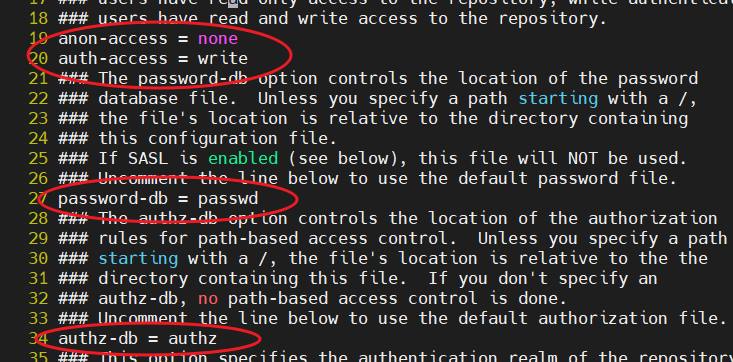

### Jenkins

持续集成、持续构建，简称 CICD


手动部署：传统的部署方式，分为多个过程（蓝色的要做的，绿色的是结果），较为繁琐


自动化部署：只用配置一次，就可以将构建部署交给 Jenkins，只用提交代码即可


### Jenkins 工作流程

Jenkins + SVN

Jenkins + GH

两个大致相同


三个虚拟机

1. SVN运行
2. Jenkins运行
3. 跑项目的虚拟机


目标效果：将工程提交到 svn 版本库里面，在页面上看到的直接就是最新的（中间省略了  jenkins 的 ci 功能）


### Jenkins 安装配置


配置 war 包部署的 tomcat 服务器


安装 jenkins :happy: （0903莫名其妙，可以安装插件嘞~）

> 部署 jenkins.war 到 tomcat/webapps 下
>
> `/root/.jenkins/secrets/initialAdminPassword` 查看密码，账户是 admin


配置：

- 允许注册、允许所有人操作
- 配置 maven、jdk
- 检查插件 subversion、deploy to container


### SVN 安装配置


> SVN 服务器安装使用
>
> centOS 安装 yum install subversion
>
> 验证 subversion --version
>
> 启动   svnserve -d -r /root/repo
>
> 打开防火墙 3690 端口并重新加载 https://blog.csdn.net/u012087785/article/details/53742923
>
> 创建仓库 subserve create myrepo，配置该仓库。主配置、用户信息、权限配置
>
> 
>
> 
>
> 


使用 eclipse 创建 maven 项目，将项目提交到 svn 版本库

> ① eclipse 新建 maven 项目
>
> 新技能：
>
> 
>
> ② eclipse 新建 svn 位置，链接 svn 仓库
>
> 
>
> ③ 将 eclipse 的 maven 工程上传到 svn 版本库
>
> **项目名 —> Teams —> SVN配置 —> 提交**


### Tomcat 服务器配置


svn 打包后将项目部署到 tomcat 服务器，需要配置角色、账号和密码


配完后可以登录到这里看看 tomcat 的一些配置：


### 第一次构建

创建任务

配置仓库 url（仓库目录`svn://xxx/appple` 加maven工程目录`appple`，**前提是把工程push到了svn仓库中**）；给 jenkins SVN中配置的账号密码

注意：使用 `@HEAD` 指向最新的版本，又说法是时区原因导致、也有说法是 jenkins 工具的原因...


构建配置：


> 小插曲，配置下maven镜像，不然下载jar包太慢
>
> 


### 构建完成后自动发布


为tomcat添加用户：

```xml
<role rolename="manager-gui"  />
<role rolename="manager-script"  />
<role rolename="manager-jmx"  />
<role rolename="manager-status"  />
<user username="engure_t" password="123qwq" roles="manager-gui,manager-script,manager-jmx,manager-status" />
```


配置Jenkins 构建后的操作：


然后在 Jenkins 上执行构建，查看 tomcat 日志：（部署日志）


上边 “手动构建”，通知 Jenkins 构建项目并把构建的war包部署到 tomcat 中。

现在的问题：开发环境下在本地 tomcat 上运行项目，当向 SVN 中推送代码时，怎么触发 Jenkins 进行构建？


### 配置构建触发


当访问某个 url 时 Jenkins 进行构建，这个 url 值需要带上用户的 token

http://192.168.217.132:8080/jenkins/job/appple/build?token=ENGURE_TOKEN


此时当访问生成的 url 时，jenkins就会进行构建


**使用 curl 命令来访问 `触发构建的URL`**


不使用 `Jenkins-Crumb` 请求头：

```bash
curl -X post -v -u engure:123123 http://192.168.217.132:8080/jenkins/job/appple/build?token=ENGURE_TOKEN
```

此时在 SVN 服务器上执行以上命令，验证是否能出发构建，很不幸报错了：

> <!doctype html><html lang="zh"><head><title>HTTP状态 401 - 未经授权的</title></head><body><h1>HTTP状态 401 - 未经授权的</h1><hr class="line" /><p><b>类型</b> 状态报告</p><p><b>消息</b> Unauthorized</p><p><b>描述</b> 因为当前请求缺少对目标资源对有效的认证信息，所以它不会实施。</p><hr class="line" /><h3>Apache Tomcat/9.0.52</h3></body></html>


于是乎使用 `Jenkins-Crumb`：在用户的设置中找到API Token（注意账户密码 和 token在 url 中一致）

> 
>
> ​	获取crumb值：
>
> 

于是得到：

```bash
curl -X post -v -u engure:123123 http://192.168.217.132:8080/jenkins/job/appple/build?token=ENGURE_TOKEN -H "Jenkins-Crumb:11933b31e9c98625bd7dcd2f583aee304a"
```

很不幸又报错了。

思考：视频教程有些年头了，jenkins版本更新，改变了方案。


解决方案：使用 “仿浏览器访问”方法 触发构建：

```bash
curl -X get http://192.168.217.132:8080/jenkins/job/appple/build?token=ENGURE_TOKEN
```


**将 curl 命令写入 jenkins 提供的 钩子程序**


jenkins的钩子程序 **示例**：版本库的 hooks 目录下


> 创建 **post-commit** 文件（**没有任何后缀**）
>
> 注释掉无用的部分，写入 curl 命令
>
> 
>
> **修改 post-commit 文件权限** 
>
> chmod 755 post-commit
>
> 


**测试构建触发**


### 结合 GitHub


### 安装使用 Git

ubuntu自带

```bash
root@engureguo-PC:/usr/local# whereis git
git: /usr/bin/git /usr/share/man/man1/git.1.gz
```


配置 Webhooks：


### 总结

学了 jenkins 使用的大致流程，还有很多细节需要进一步发现


